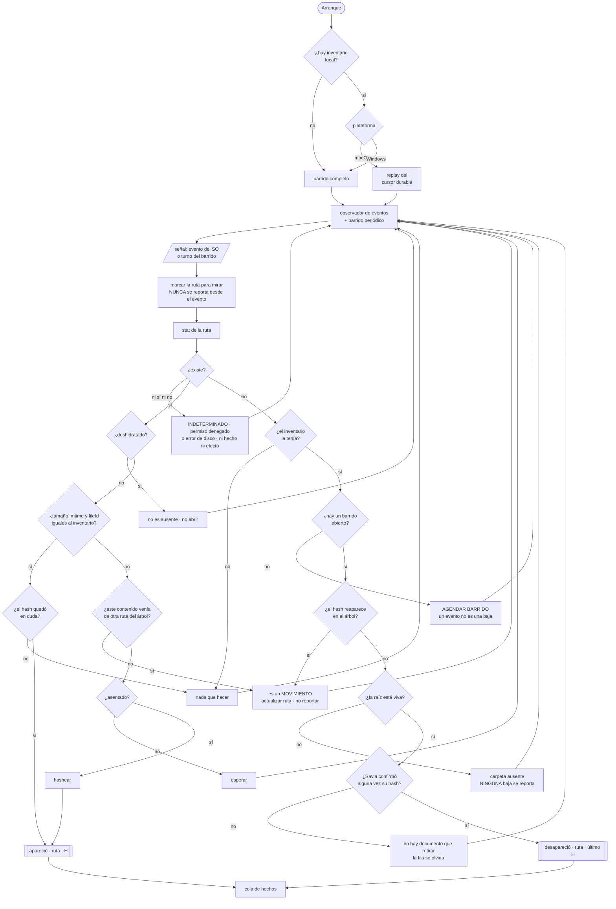
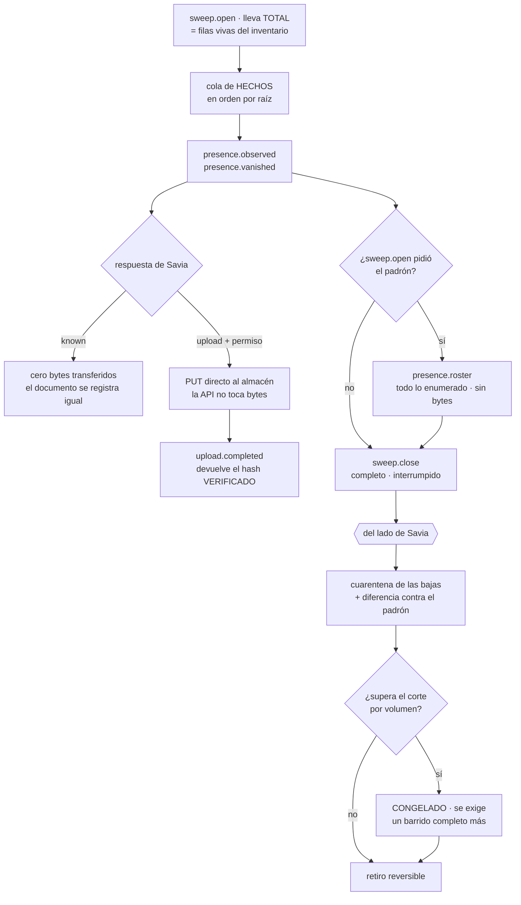

# Borrador — el agente de carpeta local

> El proceso que corre en la máquina del usuario para el canal `folder`.
> Las decisiones que gobiernan el canal —qué hace, qué decide Savia, qué pasa al
> borrar— están en [borrador-pipeline-tecnico.md § La carpeta local](borrador-pipeline-tecnico.md).
> Este documento diseña **el agente**: su forma, su protocolo y su máquina.

## Lo que es, y lo que no

Un proceso liviano que **observa una carpeta, hashea y reporta**. Nada más.

> **El agente no toma una sola decisión.**

Esa frase del plan no es una aspiración: es la línea que separa este documento en
dos. Todo lo que sigue se parte igual —**observación** de un lado, **política** del
otro— y donde algo no cae limpio en uno de los dos, va a la sección de lo abierto.

| El agente observa | Savia decide |
|---|---|
| existe · no existe · estos bytes · esta hidratación | ¿esta ausencia es una baja? ¿cuánto se espera? ¿qué fracción congela? |

La propiedad que esto compra: **la política se ajusta sin actualizar una sola
máquina**. Cambiar cuánto dura una cuarentena no puede requerir un despliegue a
cuarenta escritorios.

**No es** un cliente de sincronización. No escribe en la carpeta, no resuelve
conflictos, no baja archivos. El flujo va en una sola dirección.

## La forma

> Esta sección y la que sigue son **diseño**. Nada de la interfaz existe todavía — lo
> construido es el núcleo, y está inventariado en «Qué existe hoy del agente, y qué no».

**App de barra de menú**, en macOS y Windows a la vez, **sobre Tauri**.

Es la forma canónica de la captación pasiva —invisible hasta que hace falta— y es
lo que el usuario ya entiende de Dropbox o Drive.

**Por qué hace falta una superficie, y la razón NO es la que este documento decía.**
Decía que las salvaguardas producen un caso que necesita un humano —«desaparecieron
muchos archivos de golpe, ¿los retiro?»— y eso dejó de ser cierto: **el retiro es
siempre silencioso** y el agente no pregunta nunca. Lo que queda igual justifica la
superficie: enrolar, elegir las carpetas, ver el estado, pausar. Un proceso sin
interfaz no tiene dónde hacer ninguna de las cuatro.

### El runtime: Tauri, y la validación que lo habilitó

**Núcleo en Rust, cara en el webview del sistema.** La decisión no se tomó por gusto:
el trabajo real de este agente es sistémico —cursor durable, journal de USN,
deshidratación, identidad de volumen, un reloj que avance durante la suspensión— y eso
va en código nativo con cualquier runtime. Lo único en disputa era la cara.

**Se validó antes de decidir, porque de eso dependía la ventaja.** El argumento a favor
de un webview es reusar el lenguaje visual, y este repo lo tiene atado a Chakra: si los
valores no salieran sin ese runtime, el webview costaría igual que lo nativo y no
compraría nada. Salen. Los tokens son un objeto plano bajo `defineTokens`, así que un
paso de build los emite como variables CSS —**25 crudos y 72 semánticos, con las
referencias `{colors.x}` resueltas a `var(--color-x)`**— sin un byte de Chakra en
runtime. Verificado ejecutándolo.

Lo que **no** sale así son las *recipes* de componentes y los `textStyles`, y no
importa: este documento ya decía que los componentes no se reusan.

Se descarta **Electron-class** porque empaqueta Chromium: ~150 MB y RAM permanente en
la barra contradicen «un proceso liviano», que es la primera frase de este documento. Y
se descarta **nativo puro** porque son dos implementaciones de interfaz completas, sin
reuso, para un panel que son cinco filas y tres botones.

**Las dos plataformas desde el principio**, y no por simetría: la lógica de retiro
se rompe justo donde los dos sistemas difieren. Escribirla contra uno solo la deja
cableada a una semántica que el otro no cumple.

## Cómo se ve

### El enrolamiento

```
1. instalar            un binario, sin dependencias previas
2. vincular            el usuario aprueba el dispositivo DESDE SU CUENTA
3. permisos            acceso a disco (macOS lo pide explícito)
4. elegir la carpeta   diálogo nativo de directorio
5. primer barrido      con progreso, y se puede cerrar la ventana
```

**Vincula el usuario, no la organización.** El agente muestra un código corto y el
usuario lo aprueba desde su propia cuenta de Savia; lo que vuelve es un **token de
dispositivo** atado a esa persona. No es el login web: sobrevive a reinicios y no
expira con la sesión. Y se revoca desde la misma cuenta, como cualquier otro
dispositivo.

**Eso decide de quién es lo que entra por este canal, y encaja con lo ya escrito.** El
registro dice `dueño — un User`, y la regla de deduplicación dice que dos personas con
el mismo archivo comparten un objeto pero tienen **registros separados con dueños
distintos**. Con el enrolamiento del lado de la persona, la carpeta es un canal
**personal** por construcción: lo que sube cada uno entra con su nombre, y la
gobernanza de quién ve qué queda donde ya vive, en la Capa 3, en vez de heredarse de
quién instaló el agente.

#### El paso 2 sobre el alambre

Tres llamadas, y **las tres las inicia el agente**, por la misma razón que el resto del
protocolo: no es direccionable, así que la aprobación no le puede llegar — la tiene que
ir a buscar.

```
POST /enroll/begin   {}                  → { enrollmentId, code, expiraEn }
      ── acá el agente MUESTRA `code`, y espera ──
      ── acá la persona lo aprueba desde su cuenta ──
POST /enroll/claim   { enrollmentId }    → { status: "pending" }
                                         | { status: "approved", deviceToken, userId }
                                         | { status: "denied" | "expired" }
```

El cable va en inglés y el dominio en español, como el resto del protocolo.

**El agente no se puede aprobar a sí mismo, y eso es todo lo que el código corto
compra.** Aprobar no es una llamada del agente: es lo que hace la persona desde su
cuenta. En el simulador vive como un endpoint aparte que llama el ejercicio —nunca el
cliente— y esa separación es deliberada: si el agente pudiera llamarlo, el código corto
no ataría nada.

**`code` y `enrollmentId` son dos cosas distintas a propósito.** El `code` es corto
porque lo lee un humano; el `enrollmentId` es opaco porque con él se reclama el token.
Si se reclamara con el código corto, adivinar seis caracteres sería adivinar un token de
dispositivo.

**El token viaja en `Authorization: Bearer` en las siete llamadas del protocolo, y en
ninguna otra.** El PUT prefirmado no lo lleva —ya estaba decidido: mandarlo sería filtrar
el token a un host de almacenamiento de terceros que además eligió la respuesta del
servidor—. Y las tres de acá tampoco lo pueden llevar: son las que lo producen.

**Un `401` o un `403` detiene el DISPOSITIVO ENTERO, no la raíz.** El token es por
persona, no por carpeta. Y detiene la *cola*, no el observador: el inventario se sigue
actualizando, porque si el observador parara, las bajas de esa ventana se perderían — y
una baja perdida deja un documento indexado para siempre.

**Enrolar el dispositivo y registrar una raíz son dos actos, no uno.** El token es del
dispositivo; cada raíz se registra aparte contra él, y ese registro tiene que ser
**idempotente por `(dispositivo, identidadDeVolumen, idDelDirectorio)`**. No es una
preferencia: es un requisito que el inventario le IMPONE al enrolamiento, porque sin esa
idempotencia reelegir la misma carpeta acuña un `RootId` nuevo y duplica todos sus
documentos.

**Y hoy el token no sobrevive al proceso**, porque no hay persistencia. Cada corrida
re-enrola. Es el mismo hueco de la sección de estado, visto desde acá.

### El panel

Un ícono en la barra y, al hacer clic, un popover con lo mínimo:

```
● Sincronizado · hace 2 min           ← estado agregado, lo único siempre visible
  ─────────────────────────────
  ~/Savia                  ●          ← una fila por RAÍZ, con su propio estado
    contrato-marco.docx     indexado
    informe-q3.xlsx         procesando
  /Volumes/Archivo         ○          ← ausente: el disco no está montado
    planos.dwg              en espera ← formato que todavía no leemos
  ─────────────────────────────
  Pausar · Abrir carpeta · Ajustes
```

**Las raíces son varias, y eso cambia el panel más de lo que parece.** El estado deja de
ser uno: cada raíz tiene el suyo, y el de arriba es un agregado —basta que una esté
ausente para que el conjunto no esté sincronizado—. Toda alerta tiene que decir **de qué
raíz habla**, porque «desaparecieron 40 archivos» sin nombrar la raíz es
indistinguible entre «se desmontó un disco» y «alguien vació una carpeta».

Los estados de archivo **ya existen en el sistema de diseño** —`pending`,
`processing`, `indexed`, `failed`— y el agente los hereda. Le falta uno: `retirado`,
que en el panel es una etiqueta más pero del lado de Savia no es un estado sino un
campo (`Ingestion.retiredAt`) — la insignia se deriva de él, no lo reemplaza.

Los cuatro estados propios del agente, que no son de archivo sino de la raíz:

| Estado | Qué significa | Qué puede hacer el usuario |
|---|---|---|
| **Sincronizado** | el último barrido cerró completo | nada, y es lo normal |
| **Barriendo** | recorrido en curso, con progreso | seguir trabajando |
| **Carpeta ausente** | esa raíz no está o no es legible | reconectar el disco, o reelegir |
| **Congelado** | saltó el corte por volumen en esa raíz | **nada: se resuelve solo** |

**Carpeta ausente no es un error.** Es desconexión, y decirlo así es lo que impide
que el usuario crea que perdió algo. El agente no reporta ni una baja en ese estado.

**Y `Congelado` ya no es una pregunta.** Cuando el retiro era una decisión visible, ese
estado esperaba a un humano. Con el retiro silencioso no hay a quién preguntarle, así que
el corte por volumen deja de ser una consulta y pasa a ser **una exigencia de más
evidencia**: se retiene y se exige al menos un barrido completo más sobre esa raíz —que
es, a la vez, la prueba de que la raíz está viva y de que los archivos siguen sin estar—,
y si la ausencia sigue ahí el retiro ocurre sin
avisar. Es la misma lógica que ya gobierna la cuarentena —«una desaparición es una
hipótesis, no un hecho» y «tiempo sin observación no es evidencia»— aplicada al caso
masivo. El estado se muestra porque el usuario merece ver que algo está en curso, no
porque tenga que hacer algo.

### El lima, y dónde no va

La regla del sistema de diseño es dura: **el lima solo funciona sobre oscuro**. En un
popover de bandeja, que en macOS hereda el material de la barra y en Windows el fondo
del sistema, eso significa que el acento **no puede** ser el color de estado por
defecto. El estado se dice con los tonos ya definidos (`successInk`, `warningInk`,
`dangerInk`) y el lima queda para la única acción afirmativa del panel.

## El protocolo contra Savia

**Siete llamadas sobre seis endpoints**, y **ninguna es una invención**: cada una sale
de un hecho que el plan ya fija. Son siete y no seis porque `presence.decision` no tiene
endpoint propio —es la *respuesta* de `presence.observed`—, y esa forma tampoco es
estilo: ver «Savia solo puede pedir contestando». El vocabulario del agente es cerrado
—apareció · desapareció · barrido— y el protocolo no puede tener más verbos que esos,
más lo que la subida prefirmada obligue.

| Llamada | Dirección | Por qué existe |
|---|---|---|
| `sweep.open` | agente → Savia | El barrido es la **unidad** sobre la que se puede decir «completo» o «interrumpido». El corte por volumen compara una fracción contra un denominador, y ese denominador solo existe si el recorrido tiene borde. Lleva `total` —las filas vivas del inventario para esa raíz— y la respuesta trae `sweepId` y `padronRequerido` |
| `presence.observed` | agente → Savia | Es «apareció ruta P, contenido H». Lleva hash y **cero bytes**: es la llamada que hace posible el dedupe previo a la transferencia |
| `presence.decision` | Savia → agente | Por cada entrada: `known` (el blob ya está, no se transfiere nada, el documento se registra igual con dueño propio) o `upload` con un **permiso prefirmado** |
| `upload.completed` | agente ↔ Savia | El plan decide que la API emite el permiso y **después** verifica que el objeto llegó. El único que sabe que el PUT terminó es quien lo hizo. **Y la respuesta devuelve el hash verificado**: el que el agente mandó era una afirmación, el que el worker computó al leer el objeto es la autoridad, y entre los dos momentos el archivo pudo cambiar. Sin ese retorno, el agente y el registro pueden creer cosas distintas del mismo archivo para siempre, y una desaparición posterior no matchea con nada |
| `presence.vanished` | agente → Savia | Es «desapareció ruta P, que tenía contenido H». El nombre es deliberado: reporta un **hecho observado**, no pide un retiro |
| `presence.roster` | agente → Savia | **El padrón**: todo lo que el recorrido vio, con su hash confirmado o `None`, y cero bytes. Solo se manda si `sweep.open` lo pidió. Es lo único que puede enterar a Savia de un documento que el agente no sabe que existe — ver abajo |
| `sweep.close` | agente → Savia | Un barrido interrumpido y un borrado masivo producen el mismo conjunto de desapariciones. Sin este reporte el corte por volumen no puede distinguirlos |

**Las siete las inicia el agente, y `root.probe` murió por eso.** Había una llamada más
—`Savia → agente`, «¿la raíz está viva?»— para que la cuarentena confirmara al vencer. No
puede existir: **un agente de escritorio no es direccionable**. Está detrás de NAT, sin
puerto abierto, y la mitad del tiempo suspendido; el servidor no lo puede llamar.

Y al buscarle reemplazo resultó que no hacía falta ninguno: **la evidencia que buscaba ya
viaja en `sweep.close`**, y más fuerte. Un `root.probe` dice «la raíz existe»; un barrido
que cerró COMPLETO sobre esa raíz dice «la raíz existe **y** los archivos siguen sin
estar». Es literalmente lo que la cuarentena ya exige —«que pase la ventana y que haya
habido al menos un barrido completo más durante ella»—. Era una forma peor de preguntar
algo que otra llamada ya contesta.

**Savia solo puede pedir contestando, y de ahí sale la forma del protocolo entero.** Un
servidor que no puede iniciar nada tiene un solo canal para pedir: la respuesta a una
llamada que hizo el agente. Las dos cosas que Savia necesita viajan así, y no como
llamada — `presence.decision` contesta «mandá estos bytes» a un `presence.observed`, y
`padronRequerido` contesta «mandame el padrón» a un `sweep.open`. Eso explica también
**por qué el padrón se pide en `sweep.open` y en ningún otro lado**: es la primera
llamada del barrido, o sea el único momento en que la respuesta llega a tiempo para que
ese mismo barrido la cumpla.

**La API nunca toca bytes.** El tope de tamaño no se valida en ninguna llamada: viaja
como `content-length-range` del permiso prefirmado, que es la única palanca preventiva
que la subida directa deja en pie.

**`lastSeenByteHash` es lo que vuelve accionable una desaparición.** Sin él, «desapareció
tal cosa» no se puede mapear a ningún documento.

### El padrón, y el hueco que no cubría ninguna salvaguarda

Las cinco salvaguardas protegen contra **retirar de más**. El padrón protege contra el
error de enfrente, que es más silencioso y que no cubría nada.

**El caso.** Un barrido incremental no reporta lo que sigue igual — es justamente lo que
lo hace barato. Y tiene una consecuencia fea: si Savia tiene documentos de esa raíz que
el agente no sabe que existen —perdió su inventario, se lo restauraron de un backup
viejo, o nunca lo tuvo— esos documentos **no se van a ver faltar nunca**. No aparecen en
ningún reporte, ni de alta ni de baja. Quedan vivos del lado de Savia para siempre y
nadie se entera, ni siquiera si el archivo se borró hace un año.

**Se detecta con un número que ya viajaba.** `sweep.open` lleva `total`, la cuenta de
filas vivas del inventario del agente para esa raíz; Savia tiene su propia cuenta de
documentos vivos. Si difieren hay desfase, y la respuesta trae `padronRequerido: true`.

**Lo pide Savia, y que no lo declare el agente es lo que le da alcance.** Un agente solo
puede declarar los desfases que conoce, y los que importan son exactamente los que no:
un inventario corrupto que él cree bueno, una restauración desde un backup, o dos
agentes sobre la misma raíz. Del lado del servidor la comparación no depende de que
nadie se dé cuenta de nada.

**`hash: null` significa presente con hash desconocido, y NO ausente.** Un archivo
deshidratado no se lee nunca, así que el agente no tiene su hash. Omitirlo del padrón lo
volvería ausente y Savia lo retiraría: un archivo que está perfectamente ahí, solo que
en la nube. Presente es presente, y por qué no se pudo leer es diagnóstico del agente.

Y tres reglas que salieron de construirlo, porque las tres son formas de mentir:

- **El padrón sale del recorrido, no del inventario.** Parece que se pudiera derivar de
  las filas vivas, y no se puede: un deshidratado que el agente ve por primera vez sale
  del árbol de decisión sin un solo efecto y **no deja fila**. Derivarlo del inventario
  lo dejaría afuera del padrón — que es exactamente el caso que el padrón viene a
  arreglar. Por eso se junta durante la enumeración y se lleva encima, a diferencia de
  los bytes, que se quedan en disco y se releen: **el recorrido que vio esas rutas ya
  terminó.**
- **No pasa por el límite de lote.** Un lote de hechos truncado *demora*; un padrón
  truncado **afirma** «esto es todo lo que veo», y Savia retira todo lo que no figure.
  Truncar hechos cuesta latencia; truncar el padrón borra documentos.
- **Solo si el barrido cerró completo.** Savia también lo exige antes de aplicar la
  diferencia, y sostenerlo de los dos lados es deliberado.

**Es el único trabajo del agente que se puede perder sin perder nada.** Si el padrón se
rechaza o se cae, el próximo `sweep.open` manda el mismo `total`, Savia ve el mismo
desfase y lo vuelve a pedir: **el mecanismo que produjo el trabajo es el mismo que repara
su pérdida**. Por eso una respuesta ambigua lo da por entregado y no envenena ninguna
ruta de la raíz — un padrón rechazado no puede dejar en reintento a todos los archivos
que nombra.

**Y la diferencia pasa igual por el congelamiento.** Retirar por padrón no es una vía
rápida: si lo que falta supera el corte por volumen, esa raíz se congela y se exige un
barrido completo más, igual que cualquier otra baja. El padrón cambia **qué se ve**
faltar, no **con qué evidencia** se retira.

## La máquina del agente

### El ciclo, de punta a punta



**Son diez salidas y no siete, y las tres que faltaban no son casos raros.** Este
flujograma decía «¿existe? sí/no» y asumía que un `stat` contesta una de las dos. No
siempre: un *Full Disk Access* revocado por una actualización de macOS produce el
conjunto **completo** de ausencias de la raíz, y `ROOT` no lo atrapa porque la carpeta
se enumera perfecto. Esa tercera arista es `INDETERMINADO`, y nunca produce ni hecho ni
efecto — es la diferencia entre «no está» y «no puedo mirar».

Las ramas que hay que leer despacio, porque son las que separan este diseño de un
sincronizador ingenuo:

- **`MARK` y `SWEEP`** — un evento nunca produce un reporte. Es una señal para volver a
  mirar; el hecho sale del `stat` y del hash. Los eventos hablan de rutas, y las rutas no
  son identidad. `SWEEP` es donde eso se vuelve estructura: una ruta que falta **sin un
  barrido abierto** no es una baja, es una orden de barrer, porque solo el barrido
  establece verdad de campo.
- **`MOVE` y `DEST`** — el movimiento se mira desde los dos extremos. `MOVE` pregunta,
  antes de declarar una baja, si el contenido reapareció en otro lado. `DEST` es el mismo
  hecho visto desde el destino, y hace falta por costo: sin él, la ruta nueva es una ruta
  nueva y se hashea entera — mover una carpeta de 2 GB costaría leer 2 GB. Va **antes**
  que `SETTLE`, porque preguntarle a un archivo movido «¿estos bytes dejaron de cambiar?»
  no tiene sentido: no cambiaron, se mudaron.
- **`ROOT`** — y esta es la que evita el desastre. Si la raíz no está viva, **no se
  reporta ni una baja**. Un disco desmontado produce exactamente el mismo conjunto de
  ausencias que un borrado masivo.
- **`DOC`** — una desaparición cuyo hash Savia nunca confirmó no tiene documento que
  retirar. La fila se olvida y no viaja nada. Sin este nodo, el agente le reporta bajas
  de cosas que el servidor no tiene.
- **`DUDA`** — la única salida de `NOOP` que no es un cambio en disco, y existe porque
  sin ella un `upload.completed` cuya respuesta se perdió deja al agente sin saber qué
  hash tiene Savia. La tripleta no cambió, así que la comparación corta el paso en cada
  barrido y **esa ruta no vuelve a viajar nunca**. Se re-afirma el hash que ya se tiene
  —cero lecturas, cero bytes— y el `known` la re-confirma.

### La salida



**El orden del segmento es fijo**: abrir → observar → desvanecer → **padrón** → cerrar, y
recién después los bytes. Las apariciones van antes que las desapariciones porque «una
aparición es un hecho y una desaparición es una hipótesis»; el padrón va al final porque
solo se puede afirmar «esto es todo lo que veo» cuando el recorrido terminó.

**Los hechos van primero y los bytes después.** Es lo que impide que una semana sin
conexión se convierta en un backlog de subida de archivos que en realidad solo se
movieron: primero se pregunta, y solo se transfiere lo que Savia no tiene.

### El inventario local

Espejo de `documento.fuente`, más lo que exigen el ciclo y las salvaguardas:

| Campo | Por qué |
|---|---|
| `raizId` | Acuñado al enrolar, **no la ruta**. Las salvaguardas son *por raíz*: un disco externo desmontado no debe congelar la raíz del disco interno |
| `rutaRelativa` | Relativa y no absoluta: si el usuario mueve la raíz entera, con rutas absolutas **todos** los archivos parecen desaparecer a la vez. Con relativas, mover la raíz es **un solo hecho** |
| `tamaño` · `mtime` | La tripleta del plan, para no rehashear. El `mtime` se guarda con la precisión cruda del sistema y se compara con tolerancia: FAT tiene granularidad de dos segundos y las unidades de red truncan |
| `idDeArchivoDelSO` | Hace que renombrar y mover cuesten **cero I/O**. Es una pista que se verifica, nunca una identidad: NTFS recicla ids y un restore los cambia todos |
| `ultimoHash` | Lo que viaja en la desaparición |
| `estadoDeReporte` | Se compromete en la misma transacción que la cola: el agente nunca puede creer que Savia sabe algo que no sabe |

**Si el inventario se pierde** —reinstalación, perfil borrado— el agente hace un
barrido completo y reporta todo como observado. Savia responde `known` para todo, así
que no se transfiere un byte y no se crea un documento duplicado. El costo es un
barrido, no una re-subida: es el dedupe haciendo su trabajo.

### El ciclo

Hacen falta **los dos** mecanismos, y por razones distintas.

**Los eventos** son lo único que ve un archivo creado y borrado entre dos barridos.
Pero se pierden en silencio, y la pérdida es asimétrica: un alta perdida deja un
archivo invisible hasta el próximo barrido; **una baja perdida deja un documento
indexado para siempre**.

**El barrido** es lo único que establece verdad de campo, y por lo tanto **la única
fuente legítima de un conjunto de bajas**. Un evento nunca produce un reporte: es una
señal para volver a mirar. El hecho sale del `stat` y del hash.

Eso es lo que mantiene verdadera la frase «el agente no toma una sola decisión»: los
eventos hablan de rutas, y las rutas no son identidad.

### Dos colas, no una

El **hecho** es diminuto y siempre tiene que llegar. Los **bytes** solo se suben si
Savia contesta que no los tiene.

Sin conexión, entonces, el agente acumula hechos baratos. Al reconectar manda hechos
primero, recibe qué hashes quiere Savia, y recién ahí transfiere. Ese orden es lo que
impide que una semana desconectado se convierta en un backlog de subida de archivos
que en realidad **solo se movieron**.

La cola se drena **en orden por raíz**. `desapareció(P,H1)` seguido de `apareció(P,H2)`
es una edición; entregado al revés es el borrado de la versión nueva.

**Compactar es seguro**, y la razón está en el plan: si el usuario editó un archivo
cinco veces sin conexión, los bytes de las cuatro versiones intermedias **ya no existen
en ningún lado**. El historial es de Savia y solo de Savia; la carpeta tiene una sola
versión. Compactar al último estado no descarta nada recuperable.

Un error de credenciales **para** y avisa. Un `400` va a una cola muerta con alerta y
**nunca se descarta en silencio**.

## Las cinco salvaguardas, partidas

Ninguna es enteramente de un lado.

**1 · Cuarentena.** Se parte en dos números que el plan trata como uno:

- **Asentamiento** (agente): no reportar hasta que la ruta lleve un intervalo estable.
  Es física del sistema de archivos. Sin esto, cada `Cmd+S` en Word manda un par
  baja/alta al servidor — ruido proporcional a lo que el usuario tipea.
- **Cuarentena** (Savia): «¿esta ausencia es una baja?» es política pura, y va del
  lado del servidor porque es lo que la vuelve medible y ajustable sin tocar máquinas.

Y la cuarentena exige **dos condiciones**, no una: que pase la ventana **y** que haya
habido al menos un barrido completo más durante ella. Una máquina dormida toda la
ventana confirmaría por puro reloj sin haber vuelto a mirar. **Tiempo sin observación
no es evidencia.**

Eso obliga a un reloj **monotónico que avance durante la suspensión** —
`mach_continuous_time`, no `mach_absolute_time`; `QueryUnbiasedInterruptTime` en
Windows — porque el caso que decide si la ventana venció es justamente «pasaron seis
horas y cinco la laptop estuvo dormida».

**2 · La raíz viva.** Se enumera, no se `stat`ea. Y se verifica que sea **la misma
raíz**: identidad de volumen e id del directorio contra lo registrado al enrolar. Eso
atrapa el caso peor — el volumen no montó y quedó, en el mismo path, un directorio
vacío haciendo de suplente.

**3 · Corte por volumen.** Del lado de Savia, sobre el denominador que da `sweep.open`.

**4 · Correlación por contenido.** Un hash que reaparece en cualquier punto del árbol
dentro de la ventana es un **movimiento**, no una baja.

**5 · Deshidratado ≠ ausente.** Ver abajo: es donde los dos sistemas más difieren, y
donde el error es más caro.

## Lo que macOS y Windows no comparten

No son wrappers sobre una abstracción común. En dos casos son **políticas distintas**.

**El cursor durable.** macOS da a un proceso sin privilegios un cursor persistente y
replayable: «qué cambió mientras estuve apagado» es una consulta barata. Windows no da
nada equivalente sin ser administrador y sin acceso a todo el volumen. **Consecuencia:
en macOS el arranque puede ser un replay; en Windows el arranque es un barrido completo
obligatorio.** Dos políticas, no dos envoltorios.

**La deshidratación.** Windows detecta desde la enumeración y **puede abrir sin
hidratar**. macOS detecta por atributos pero **no tiene forma de leer sin
materializar**. En macOS la comprobación previa no es una optimización: es lo único
que impide que el agente **descargue el drive de nube completo del usuario**.

**La identidad de archivo y la de la raíz.** Distinto ancho, distinta adquisición,
distinta estabilidad. Y ninguna ruta absoluta sirve en ninguno de los dos: las letras
de unidad se reasignan en Windows, y en macOS montar dos veces produce
`/Volumes/Nombre 1`.

**La semántica de rutas.** Mayúsculas, separadores, nombres reservados, longitud
máxima, normalización Unicode. `rutaRelativa` es una clave del protocolo, así que su
forma canónica es parte del contrato y no un detalle de implementación.

## Qué falta del lado de Savia

El agente **no tiene con qué hablar todavía**. En orden de dependencia:

1. **Un servicio HTTP que exista.** `apps/api/` es un README. Y no puede vivir en
   `packages/orchestration`: su guardián de fronteras prohíbe dependencias de runtime,
   así que un servidor ahí no pasa el lint. La orquestación **se consume** desde la
   API, no se convierte en ella.
2. **El campo `fuente` en `Ingestion`** — y va primero, porque `ir` se congela primero.
   Es cambio de contrato: el término entra al glosario antes que al código.
3. **Persistencia.** No hay ninguna: ni schema, ni migraciones, ni cliente. Hace falta
   la fila `documento`, el índice de reconciliación y la consulta `hash → documento`
   **filtrada por organización**.
4. **Una implementación de `Storage`.** El puerto son dos métodos y nadie lo implementa.
5. **El filtro de los retirados** — y este punto **cambió** desde que se escribió.
   Decía «`retirado` como noveno estado, más las transiciones», y las dos mitades
   caducaron: la máquina de estados ya tiene transiciones (`TRANSITIONS`, `isTerminal`,
   `canTransition`), y el retiro **no quedó como estado**. Es `Ingestion.retiredAt`, un
   instante nulable — como noveno estado destruía `isTerminal`, porque el retiro es
   alcanzable desde los ocho y ninguno quedaba con grado de salida cero. Ver
   [`packages/ir/GLOSARIO.md`](../../../packages/ir/GLOSARIO.md), P30. Lo que falta es
   lo que el campo **no hace**: sacar al documento de la búsqueda, de la síntesis y del
   índice son tres filtros de tres consumidores, y ninguno existe.
6. **Los números de la cuarentena**, a `PARAMETERS`, en `null`, con unidad y con cómo
   se medirían. Ninguno se inventa.
7. **Enrolamiento y auth de máquina.** Del lado de Savia no existe nada: ni la pantalla
   donde la persona aprueba un código, ni la emisión del token, ni la lista de
   dispositivos desde la que se revoca. El **contrato** sí está fijado y ejercido contra
   el simulador —tres llamadas, ver «El paso 2 sobre el alambre»—, así que lo que falta
   es implementarlo, no diseñarlo.

## Qué existe hoy del agente, y qué no

Este documento dijo que el agente se podía construir contra un servidor simulado sin
esperar a nada. **Se hizo, y eso partió el agente en dos mitades muy distintas.**

### El núcleo existe, y corre

`apps/folder-agent/src-tauri/` — **6.649 líneas de Rust en 18 módulos, con 79 pruebas**:
74 en proceso sobre la máquina, las salvaguardas, las colas y los guardianes, y **5 que
hablan HTTP de verdad** contra `sim/server.ts`, el servidor simulado, que a su vez lleva
26 afirmaciones propias. Cubre el árbol de decisión completo con sus diez salidas, el
inventario, las cinco salvaguardas, las dos colas con su orden y su compactación, el
cliente con las siete llamadas, y **el enrolamiento con sus tres**.

Y la cadena la corre `turbo lint`: los seis peldaños —`fmt` → `clippy` → cross-check de
Windows → las pruebas → el ejercicio → el banco— en 25 s.

Del tramo de plataforma, **macOS es la única implementación real** —`mach_continuous_time`
para el reloj que avanza durante la suspensión, y `SF_DATALESS` por `lstat` para
detectar la deshidratación sin materializar—. Windows tiene la firma completa y el cuerpo
en `unimplemented!()`, acreditado con `cargo check --target x86_64-pc-windows-msvc`, que
compila limpio: la firma es correcta aunque no haga nada.

### Nada de lo que se ve existe

`src-tauri/` es un nombre que anticipa el runtime: **Tauri ni siquiera es dependencia.**
El crate depende de `libc`, `sha2`, `serde` y `serde_json`, y de nada más. No hay ícono
de bandeja, ni popover, ni ventana de preferencias, ni selector de directorio. Hoy el
agente es un binario de línea de comandos que toma una ruta y una URL:

```
node apps/folder-agent/sim/server.ts        # en otra terminal
cargo run -- <ruta-de-la-raíz> [http://127.0.0.1:4477]
```

**Del enrolamiento existe el paso 2 y nada más.** El agente pide un código, lo muestra,
espera a que una persona lo apruebe y reclama su token; el token viaja en
`Authorization: Bearer` en las siete llamadas, un `401` detiene el dispositivo entero, y
la revocación desde la cuenta lo apaga — todo eso está construido contra el simulador y
acreditado, incluido que **el cliente no tiene con qué aprobarse a sí mismo**.

Lo que no existe son los otros cuatro pasos: **sin instalador, sin permisos de disco, sin
selector de carpeta y sin primer barrido con progreso**. Y el token no sobrevive al
proceso, porque no hay persistencia. Sigue siendo cierto que no hay nada que instalar —
pero ya no es cierto que no haya con qué vincularse.

### Y dos huecos que no son de interfaz

- **La persistencia no existe.** El inventario vive en memoria y muere con el proceso. El
  diseño pedía SQLite; lo que ese diseño compra y hoy **no** se paga es la durabilidad, y
  lo que compra y **sí** se paga es la atomicidad — el estado y la cola viven en el mismo
  `Almacen` y se escriben en una sola llamada, así que no hay forma de hacer una sin la
  otra.
- **No hay observador de eventos del sistema de archivos.** El tipo `OrigenDeSenal`
  distingue evento de barrido y el árbol de decisión ya trata el caso —una ruta que falta
  sin barrido abierto agenda uno en vez de reportar una baja—, pero no hay nada que
  produzca esos eventos: ni FSEvents ni `ReadDirectoryChangesW`.

Ninguno de los dos cambia una decisión de este documento. Los dos son trabajo.

## Qué se reusa del sistema de diseño, y qué no

**Los valores, sí. Los componentes, casi nada.**

Se reusan la paleta entera, la escala tipográfica, los radios, el espaciado, la curva
de animación y la marca —que es un SVG sin dependencias—. Y se reusan las **decisiones**:
la jerarquía de superficies, la regla del lima, los tonos de estado.

No se reusan los componentes, salvo que la ventana termine siendo un webview. Y aun
así falta todo el *chrome* de escritorio, que la librería no tiene: el ítem de bandeja,
el popover, la ventana de preferencias, el selector de directorio nativo —el `DropZone`
del navegador no sirve, entrega archivos sin ruta— y los flujos del sistema operativo
(permisos, arranque al login, auto-update).

Falta además un artefacto de tokens **agnóstico**: hoy el barril arrastra el runtime de
Chakra, y los valores tendrían que poder emitirse como variables CSS o constantes
nativas.

## Las decisiones, cerradas

Las nueve que este documento y el plan tenían abiertas. Cuatro son de producto y las
demás salen de lo ya escrito.

**1 · El runtime es Tauri**, y se validó antes de decidirlo. Ver «La forma».

**2 · El retiro es siempre silencioso.** El agente no pregunta nunca, ni siquiera cuando
salta el corte por volumen. Lo que lo hace tolerable es que **el retiro es reversible por
diseño**: si el archivo vuelve, el documento vuelve entero, con sus anotaciones, sus
`ElementId` y su `selladoEn`. Un falso positivo cuesta un `Cmd+Z` en el Finder, no una
pérdida. Preguntar habría comprado seguridad contra algo que ya es recuperable, a cambio
de romper lo único que este canal promete: que no hay que hacer nada.

**3 · Las raíces son varias**, desde el principio. El inventario y las salvaguardas ya
estaban modelados por raíz, así que el costo es de interfaz: el estado se vuelve un
agregado y toda alerta tiene que nombrar su raíz.

**4 · La revocación es solo de la persona.** El enrolamiento es personal y la revocación
también; una organización no puede revocarle el dispositivo a alguien. **Esto no cierra
la tensión que lo motivaba, la deja entera** — ver abajo.

**5 · La línea entre asentamiento y cuarentena: gobiernan eventos distintos.** Se trataban
como un número porque los dos son «esperar un poco», y esperan cosas que no se parecen:

| | Asentamiento | Cuarentena |
|---|---|---|
| **Dueño** | el agente | Savia |
| **Sujeto** | un archivo | una raíz |
| **Dispara con** | una **aparición** o una modificación | una **desaparición** |
| **Pregunta** | ¿estos bytes dejaron de cambiar? | ¿esta ausencia es una baja? |
| **Naturaleza** | física del sistema de archivos | política |

**Nunca se aplican al mismo evento**, y esa es la línea: el asentamiento gobierna las
altas, la cuarentena gobierna las bajas. Un archivo que se está guardando no se reporta;
un archivo que se fue no se retira todavía. Son dos esperas y ningún solapamiento.

**6 · `maxRetries` del agente NO va al contrato.** `PARAMETERS` vive en `@savia-os/ir`,
que tiene cero dependencias de runtime y ningún conocimiento del agente; meter ahí un
número que solo consume un binario de escritorio sería un parámetro sin consumidor en el
paquete que más cuida no tenerlos. Va del lado del agente **con la misma disciplina**:
unidad, qué decide y cómo se mediría el definitivo, y arranca sin valor inventado.

**7 · Si el usuario mueve la raíz entera, el agente NO la busca.** Rastrear el disco
detrás de una carpeta que se movió es caro y es intrusivo. La raíz pasa a «Carpeta
ausente» y —por la salvaguarda que ya existe— **no se reporta ni una baja**. Si el usuario
la vuelve a elegir en su ubicación nueva, la identidad de volumen y la del directorio
coinciden con lo registrado al enrolar, así que es **el mismo `RootId`**: las rutas
relativas siguen valiendo todas y no se genera un solo evento. Ese es el pago de que
`RootId` no sea una ruta.

**8 · A los retirados los filtra UN punto, no tres.** La tentación es que la búsqueda, la
síntesis y el índice filtren cada uno por `retiredAt is null`. Son tres sitios y tres
oportunidades de olvidarse, y el que se olvide va a servir contenido que el usuario cree
haber sacado. Se decide ahora, mientras no existe ninguno de los tres, que la regla se
impone en la consulta que los tres comparten. Después son tres refactors.

**9 · La forma canónica de `path`: NFC y separador `/`.** Parecía difícil porque asumía
que el servidor compara rutas. **No las compara nunca**: la identidad es el contenido, y
esa decisión es la primera de este canal. La ruta solo se guarda para mostrarla, así que
la canonicalización tiene que comprar una sola cosa —que el mismo archivo no aparezca con
dos grafías— y NFC más `/` alcanza. La sensibilidad a mayúsculas queda del lado del
agente, que es el único que sabe si su sistema de archivos las distingue.

## Lo que sigue abierto

- **La tensión de Capa 3, entera.** Un documento captado de la carpeta de alguien puede
  estar alimentando un skill del que depende otro equipo, y que esa persona ordene su
  escritorio lo degrada. Descartar que la organización revoque el dispositivo **no
  resuelve esto**: solo dice que la palanca no es esa. Sigue siendo gobernanza, y sigue
  sin dueño.
- **Los cuatro números, todos sin valor.** El intervalo de asentamiento, la ventana de
  cuarentena, la fracción del corte por volumen y el `maxRetries` del agente. Ninguno se
  inventa: cada uno necesita unidad, qué decide y cómo se mediría.
- **Qué es exactamente el denominador del corte por volumen.** El agente manda en
  `sweep.open` el tamaño de su inventario para esa raíz, que es lo único que se conoce al
  *abrir* el barrido: lo enumerado todavía no se sabe. El simulador lo guarda y calcula
  la fracción sobre lo vivo de **su** lado. Los dos números son defendibles y no son el
  mismo; cuál gobierna el corte no está decidido, y hoy `total` sirve para detectar el
  desfase y nada más.
- **La carrocería del agente no existe.** La interfaz, el enrolamiento, la persistencia y
  los eventos del sistema de archivos — ver «Qué existe hoy del agente, y qué no». El
  núcleo sí, y lleva 75 pruebas.
