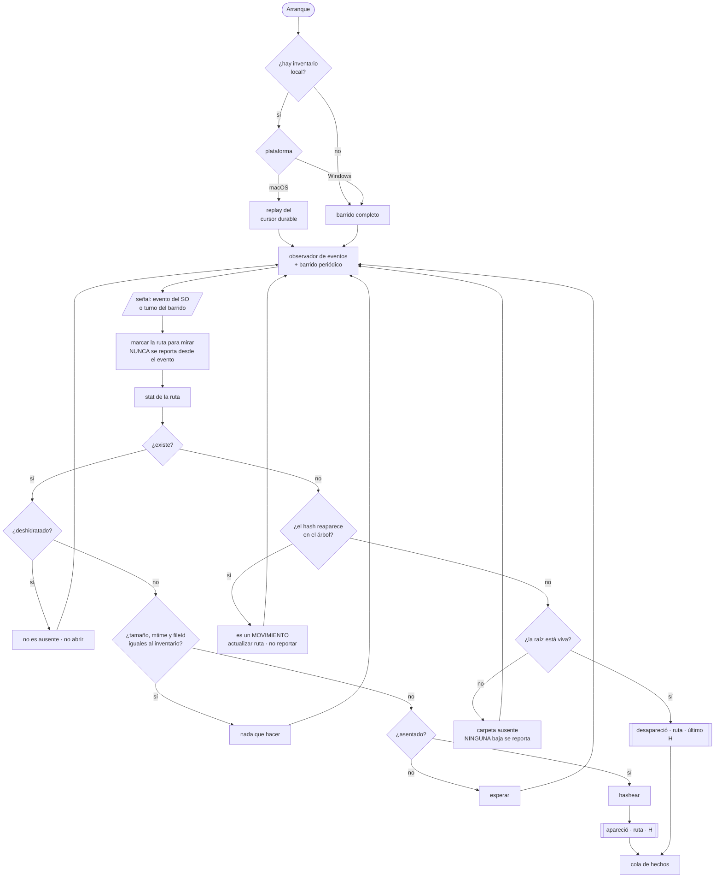
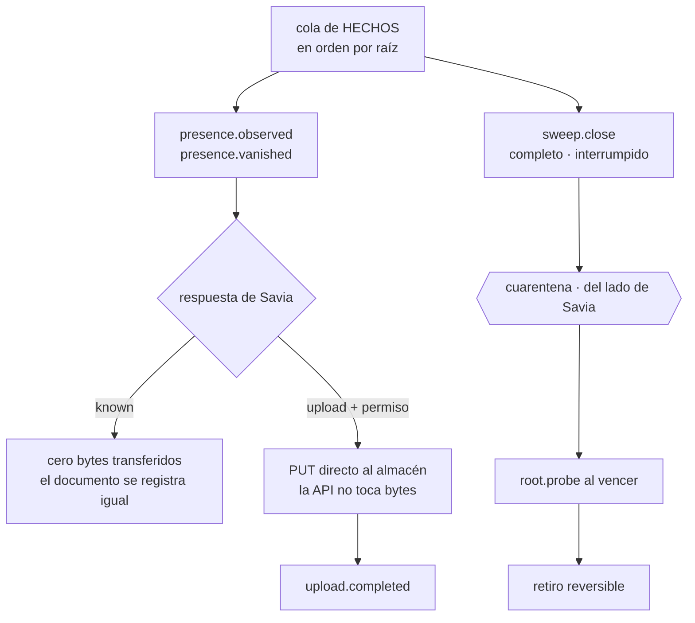

# Borrador — el agente de carpeta local

> El proceso que corre en la máquina del usuario para el canal `folder`.
> Las decisiones que gobiernan el canal —qué hace, qué decide Savia, qué pasa al
> borrar— están en [borrador-pipeline-tecnico.md § La carpeta local](borrador-pipeline-tecnico.md).
> Este documento diseña **el agente**: su forma, su protocolo y su máquina.

## Lo que es, y lo que no

Un proceso liviano que **observa una carpeta, hashea y reporta**. Nada más.

> **El agente no toma una sola decisión.**

Esa frase del plan no es una aspiración: es la línea que separa este documento en
dos. Todo lo que sigue se parte igual —**observación** de un lado, **política** del
otro— y donde algo no cae limpio en uno de los dos, va a la sección de lo abierto.

| El agente observa | Savia decide |
|---|---|
| existe · no existe · estos bytes · esta hidratación | ¿esta ausencia es una baja? ¿cuánto se espera? ¿qué fracción congela? |

La propiedad que esto compra: **la política se ajusta sin actualizar una sola
máquina**. Cambiar cuánto dura una cuarentena no puede requerir un despliegue a
cuarenta escritorios.

**No es** un cliente de sincronización. No escribe en la carpeta, no resuelve
conflictos, no baja archivos. El flujo va en una sola dirección.

## La forma

**App de barra de menú**, en macOS y Windows a la vez.

Es la forma canónica de la captación pasiva —invisible hasta que hace falta— y es
lo que el usuario ya entiende de Dropbox o Drive. Y hace falta *alguna* superficie:
las salvaguardas producen exactamente un caso que necesita un humano —«desaparecieron
muchos archivos de golpe, ¿los retiro?»— y un proceso sin interfaz no tiene dónde
preguntarlo.

**Las dos plataformas desde el principio**, y no por simetría: la lógica de retiro
se rompe justo donde los dos sistemas difieren. Escribirla contra uno solo la deja
cableada a una semántica que el otro no cumple.

## Cómo se ve

### El enrolamiento

```
1. instalar            un binario, sin dependencias previas
2. vincular            el usuario aprueba el dispositivo DESDE SU CUENTA
3. permisos            acceso a disco (macOS lo pide explícito)
4. elegir la carpeta   diálogo nativo de directorio
5. primer barrido      con progreso, y se puede cerrar la ventana
```

**Vincula el usuario, no la organización.** El agente muestra un código corto y el
usuario lo aprueba desde su propia cuenta de Savia; lo que vuelve es un **token de
dispositivo** atado a esa persona. No es el login web: sobrevive a reinicios y no
expira con la sesión. Y se revoca desde la misma cuenta, como cualquier otro
dispositivo.

**Eso decide de quién es lo que entra por este canal, y encaja con lo ya escrito.** El
registro dice `dueño — un User`, y la regla de deduplicación dice que dos personas con
el mismo archivo comparten un objeto pero tienen **registros separados con dueños
distintos**. Con el enrolamiento del lado de la persona, la carpeta es un canal
**personal** por construcción: lo que sube cada uno entra con su nombre, y la
gobernanza de quién ve qué queda donde ya vive, en la Capa 3, en vez de heredarse de
quién instaló el agente.

### El panel

Un ícono en la barra y, al hacer clic, un popover con lo mínimo:

```
● Sincronizado · hace 2 min           ← estado, y es lo único siempre visible
  ~/Savia                             ← la raíz vigilada
  ─────────────────────────────
  contrato-marco.docx     indexado
  informe-q3.xlsx         procesando
  planos.dwg              en espera   ← formato que todavía no leemos
  ─────────────────────────────
  Pausar · Abrir carpeta · Ajustes
```

Los estados de archivo **ya existen en el sistema de diseño** —`pending`,
`processing`, `indexed`, `failed`— y el agente los hereda. Le falta uno: `retirado`,
que en el panel es una etiqueta más pero del lado de Savia no es un estado sino un
campo (`Ingestion.retiredAt`) — la insignia se deriva de él, no lo reemplaza.

Los cuatro estados propios del agente, que no son de archivo sino de la raíz:

| Estado | Qué significa | Qué puede hacer el usuario |
|---|---|---|
| **Sincronizado** | el último barrido cerró completo | nada, y es lo normal |
| **Barriendo** | recorrido en curso, con progreso | seguir trabajando |
| **Carpeta ausente** | la raíz no está o no es legible | reconectar el disco, o reelegir |
| **Congelado** | saltó el corte por volumen | confirmar o descartar el retiro |

**Carpeta ausente no es un error.** Es desconexión, y decirlo así es lo que impide
que el usuario crea que perdió algo. El agente no reporta ni una baja en ese estado.

### El lima, y dónde no va

La regla del sistema de diseño es dura: **el lima solo funciona sobre oscuro**. En un
popover de bandeja, que en macOS hereda el material de la barra y en Windows el fondo
del sistema, eso significa que el acento **no puede** ser el color de estado por
defecto. El estado se dice con los tonos ya definidos (`successInk`, `warningInk`,
`dangerInk`) y el lima queda para la única acción afirmativa del panel.

## El protocolo contra Savia

Siete llamadas, y **ninguna es una invención**: cada una sale de un hecho que el plan
ya fija. El vocabulario del agente es cerrado —apareció · desapareció · barrido— y el
protocolo no puede tener más verbos que esos, más lo que la subida prefirmada obligue.

| Llamada | Dirección | Por qué existe |
|---|---|---|
| `sweep.open` | agente → Savia | El barrido es la **unidad** sobre la que se puede decir «completo» o «interrumpido». El corte por volumen compara una fracción contra un denominador, y ese denominador solo existe si el recorrido tiene borde |
| `presence.observed` | agente → Savia | Es «apareció ruta P, contenido H». Lleva hash y **cero bytes**: es la llamada que hace posible el dedupe previo a la transferencia |
| `presence.decision` | Savia → agente | Por cada entrada: `known` (el blob ya está, no se transfiere nada, el documento se registra igual con dueño propio) o `upload` con un **permiso prefirmado** |
| `upload.completed` | agente ↔ Savia | El plan decide que la API emite el permiso y **después** verifica que el objeto llegó. El único que sabe que el PUT terminó es quien lo hizo. **Y la respuesta devuelve el hash verificado**: el que el agente mandó era una afirmación, el que el worker computó al leer el objeto es la autoridad, y entre los dos momentos el archivo pudo cambiar. Sin ese retorno, el agente y el registro pueden creer cosas distintas del mismo archivo para siempre, y una desaparición posterior no matchea con nada |
| `presence.vanished` | agente → Savia | Es «desapareció ruta P, que tenía contenido H». El nombre es deliberado: reporta un **hecho observado**, no pide un retiro |
| `sweep.close` | agente → Savia | Un barrido interrumpido y un borrado masivo producen el mismo conjunto de desapariciones. Sin este reporte el corte por volumen no puede distinguirlos |
| `root.probe` | Savia → agente | La cuarentena vence del lado del servidor, y la salvaguarda exige confirmar que la raíz está viva **en ese momento**, no cuando se observó |

**La API nunca toca bytes.** El tope de tamaño no se valida en ninguna llamada: viaja
como `content-length-range` del permiso prefirmado, que es la única palanca preventiva
que la subida directa deja en pie.

**`lastSeenByteHash` es lo que vuelve accionable una desaparición.** Sin él, «desapareció
tal cosa» no se puede mapear a ningún documento.

## La máquina del agente

### El ciclo, de punta a punta



Las tres ramas que hay que leer despacio, porque son las que separan este diseño de un
sincronizador ingenuo:

- **`MARK`** — un evento nunca produce un reporte. Es una señal para volver a mirar; el
  hecho sale del `stat` y del hash. Los eventos hablan de rutas, y las rutas no son
  identidad.
- **`MOVE`** — antes de declarar una baja se pregunta si el contenido reapareció en otro
  lado. Mover y renombrar mueren acá, y no llegan nunca al servidor.
- **`ROOT`** — y esta es la que evita el desastre. Si la raíz no está viva, **no se
  reporta ni una baja**. Un disco desmontado produce exactamente el mismo conjunto de
  ausencias que un borrado masivo.

### La salida



**Los hechos van primero y los bytes después.** Es lo que impide que una semana sin
conexión se convierta en un backlog de subida de archivos que en realidad solo se
movieron: primero se pregunta, y solo se transfiere lo que Savia no tiene.

### El inventario local

Espejo de `documento.fuente`, más lo que exigen el ciclo y las salvaguardas:

| Campo | Por qué |
|---|---|
| `raizId` | Acuñado al enrolar, **no la ruta**. Las salvaguardas son *por raíz*: un disco externo desmontado no debe congelar la raíz del disco interno |
| `rutaRelativa` | Relativa y no absoluta: si el usuario mueve la raíz entera, con rutas absolutas **todos** los archivos parecen desaparecer a la vez. Con relativas, mover la raíz es **un solo hecho** |
| `tamaño` · `mtime` | La tripleta del plan, para no rehashear. El `mtime` se guarda con la precisión cruda del sistema y se compara con tolerancia: FAT tiene granularidad de dos segundos y las unidades de red truncan |
| `idDeArchivoDelSO` | Hace que renombrar y mover cuesten **cero I/O**. Es una pista que se verifica, nunca una identidad: NTFS recicla ids y un restore los cambia todos |
| `ultimoHash` | Lo que viaja en la desaparición |
| `estadoDeReporte` | Se compromete en la misma transacción que la cola: el agente nunca puede creer que Savia sabe algo que no sabe |

**Si el inventario se pierde** —reinstalación, perfil borrado— el agente hace un
barrido completo y reporta todo como observado. Savia responde `known` para todo, así
que no se transfiere un byte y no se crea un documento duplicado. El costo es un
barrido, no una re-subida: es el dedupe haciendo su trabajo.

### El ciclo

Hacen falta **los dos** mecanismos, y por razones distintas.

**Los eventos** son lo único que ve un archivo creado y borrado entre dos barridos.
Pero se pierden en silencio, y la pérdida es asimétrica: un alta perdida deja un
archivo invisible hasta el próximo barrido; **una baja perdida deja un documento
indexado para siempre**.

**El barrido** es lo único que establece verdad de campo, y por lo tanto **la única
fuente legítima de un conjunto de bajas**. Un evento nunca produce un reporte: es una
señal para volver a mirar. El hecho sale del `stat` y del hash.

Eso es lo que mantiene verdadera la frase «el agente no toma una sola decisión»: los
eventos hablan de rutas, y las rutas no son identidad.

### Dos colas, no una

El **hecho** es diminuto y siempre tiene que llegar. Los **bytes** solo se suben si
Savia contesta que no los tiene.

Sin conexión, entonces, el agente acumula hechos baratos. Al reconectar manda hechos
primero, recibe qué hashes quiere Savia, y recién ahí transfiere. Ese orden es lo que
impide que una semana desconectado se convierta en un backlog de subida de archivos
que en realidad **solo se movieron**.

La cola se drena **en orden por raíz**. `desapareció(P,H1)` seguido de `apareció(P,H2)`
es una edición; entregado al revés es el borrado de la versión nueva.

**Compactar es seguro**, y la razón está en el plan: si el usuario editó un archivo
cinco veces sin conexión, los bytes de las cuatro versiones intermedias **ya no existen
en ningún lado**. El historial es de Savia y solo de Savia; la carpeta tiene una sola
versión. Compactar al último estado no descarta nada recuperable.

Un error de credenciales **para** y avisa. Un `400` va a una cola muerta con alerta y
**nunca se descarta en silencio**.

## Las cinco salvaguardas, partidas

Ninguna es enteramente de un lado.

**1 · Cuarentena.** Se parte en dos números que el plan trata como uno:

- **Asentamiento** (agente): no reportar hasta que la ruta lleve un intervalo estable.
  Es física del sistema de archivos. Sin esto, cada `Cmd+S` en Word manda un par
  baja/alta al servidor — ruido proporcional a lo que el usuario tipea.
- **Cuarentena** (Savia): «¿esta ausencia es una baja?» es política pura, y va del
  lado del servidor porque es lo que la vuelve medible y ajustable sin tocar máquinas.

Y la cuarentena exige **dos condiciones**, no una: que pase la ventana **y** que haya
habido al menos un barrido completo más durante ella. Una máquina dormida toda la
ventana confirmaría por puro reloj sin haber vuelto a mirar. **Tiempo sin observación
no es evidencia.**

Eso obliga a un reloj **monotónico que avance durante la suspensión** —
`mach_continuous_time`, no `mach_absolute_time`; `QueryUnbiasedInterruptTime` en
Windows — porque el caso que decide si la ventana venció es justamente «pasaron seis
horas y cinco la laptop estuvo dormida».

**2 · La raíz viva.** Se enumera, no se `stat`ea. Y se verifica que sea **la misma
raíz**: identidad de volumen e id del directorio contra lo registrado al enrolar. Eso
atrapa el caso peor — el volumen no montó y quedó, en el mismo path, un directorio
vacío haciendo de suplente.

**3 · Corte por volumen.** Del lado de Savia, sobre el denominador que da `sweep.open`.

**4 · Correlación por contenido.** Un hash que reaparece en cualquier punto del árbol
dentro de la ventana es un **movimiento**, no una baja.

**5 · Deshidratado ≠ ausente.** Ver abajo: es donde los dos sistemas más difieren, y
donde el error es más caro.

## Lo que macOS y Windows no comparten

No son wrappers sobre una abstracción común. En dos casos son **políticas distintas**.

**El cursor durable.** macOS da a un proceso sin privilegios un cursor persistente y
replayable: «qué cambió mientras estuve apagado» es una consulta barata. Windows no da
nada equivalente sin ser administrador y sin acceso a todo el volumen. **Consecuencia:
en macOS el arranque puede ser un replay; en Windows el arranque es un barrido completo
obligatorio.** Dos políticas, no dos envoltorios.

**La deshidratación.** Windows detecta desde la enumeración y **puede abrir sin
hidratar**. macOS detecta por atributos pero **no tiene forma de leer sin
materializar**. En macOS la comprobación previa no es una optimización: es lo único
que impide que el agente **descargue el drive de nube completo del usuario**.

**La identidad de archivo y la de la raíz.** Distinto ancho, distinta adquisición,
distinta estabilidad. Y ninguna ruta absoluta sirve en ninguno de los dos: las letras
de unidad se reasignan en Windows, y en macOS montar dos veces produce
`/Volumes/Nombre 1`.

**La semántica de rutas.** Mayúsculas, separadores, nombres reservados, longitud
máxima, normalización Unicode. `rutaRelativa` es una clave del protocolo, así que su
forma canónica es parte del contrato y no un detalle de implementación.

## Qué falta del lado de Savia

El agente **no tiene con qué hablar todavía**. En orden de dependencia:

1. **Un servicio HTTP que exista.** `apps/api/` es un README. Y no puede vivir en
   `packages/orchestration`: su guardián de fronteras prohíbe dependencias de runtime,
   así que un servidor ahí no pasa el lint. La orquestación **se consume** desde la
   API, no se convierte en ella.
2. **El campo `fuente` en `Ingestion`** — y va primero, porque `ir` se congela primero.
   Es cambio de contrato: el término entra al glosario antes que al código.
3. **Persistencia.** No hay ninguna: ni schema, ni migraciones, ni cliente. Hace falta
   la fila `documento`, el índice de reconciliación y la consulta `hash → documento`
   **filtrada por organización**.
4. **Una implementación de `Storage`.** El puerto son dos métodos y nadie lo implementa.
5. **El filtro de los retirados** — y este punto **cambió** desde que se escribió.
   Decía «`retirado` como noveno estado, más las transiciones», y las dos mitades
   caducaron: la máquina de estados ya tiene transiciones (`TRANSITIONS`, `isTerminal`,
   `canTransition`), y el retiro **no quedó como estado**. Es `Ingestion.retiredAt`, un
   instante nulable — como noveno estado destruía `isTerminal`, porque el retiro es
   alcanzable desde los ocho y ninguno quedaba con grado de salida cero. Ver
   [`packages/ir/GLOSARIO.md`](../../../packages/ir/GLOSARIO.md), P30. Lo que falta es
   lo que el campo **no hace**: sacar al documento de la búsqueda, de la síntesis y del
   índice son tres filtros de tres consumidores, y ninguno existe.
6. **Los números de la cuarentena**, a `PARAMETERS`, en `null`, con unidad y con cómo
   se medirían. Ninguno se inventa.
7. **Enrolamiento y auth de máquina.** El token de dispositivo no existe.

**Lo que sí se puede hacer en paralelo:** el protocolo está completamente especificado
arriba, así que el agente se puede construir contra un servidor simulado y enchufarse
después. Es la única parte que no espera a nada.

## Qué se reusa del sistema de diseño, y qué no

**Los valores, sí. Los componentes, casi nada.**

Se reusan la paleta entera, la escala tipográfica, los radios, el espaciado, la curva
de animación y la marca —que es un SVG sin dependencias—. Y se reusan las **decisiones**:
la jerarquía de superficies, la regla del lima, los tonos de estado.

No se reusan los componentes, salvo que la ventana termine siendo un webview. Y aun
así falta todo el *chrome* de escritorio, que la librería no tiene: el ítem de bandeja,
el popover, la ventana de preferencias, el selector de directorio nativo —el `DropZone`
del navegador no sirve, entrega archivos sin ruta— y los flujos del sistema operativo
(permisos, arranque al login, auto-update).

Falta además un artefacto de tokens **agnóstico**: hoy el barril arrastra el runtime de
Chakra, y los valores tendrían que poder emitirse como variables CSS o constantes
nativas.

## Qué queda abierto

- **Dónde corre exactamente la línea entre asentamiento y cuarentena.** El plan trata
  los dos como un número y son dos, con dueños distintos.
- **El stack.** La forma está decidida, el runtime no. Un webview reusa el sistema de
  diseño y pesa; uno nativo no reusa nada y es dos implementaciones de interfaz.
- **Varias raíces o una.** El inventario ya está modelado por raíz, así que soportar
  varias es barato; lo que no está decidido es si el producto las quiere.
- **Si la organización puede revocar un dispositivo de una persona.** El enrolamiento
  es personal, pero un equipo puede depender de lo que esa carpeta alimenta. Es
  gobernanza de Capa 3, no del agente — pero el agente tiene que tolerar que le
  revoquen el token sin que él lo haya pedido, y eso sí es de este documento.
- **`maxRetries` del agente.** El parámetro existe en `PARAMETERS` pero es del lado del
  servidor. El agente necesita el suyo.
- **Qué hace el agente cuando el usuario mueve la raíz entera.** Las rutas relativas
  convierten eso en un solo hecho, pero quién lo reconcilia —y si se le pregunta al
  usuario— no está decidido.
